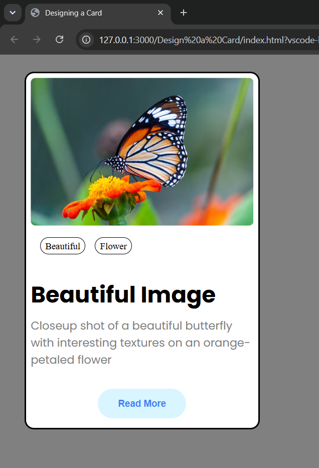

# Card Design

A simple card design created using HTML and CSS.

## Technologies Used

- HTML5
- CSS3
- Google Fonts

## Features

- Image-based card layout
- Category tags
- Custom text styling
- Rounded corners
- Styled Read More button

## Preview

## What I Learned

This project helped me practice:

- Structuring a webpage using HTML
- Working with images and text
- Using the CSS box model
- Styling fonts, colors, and text
- Using margins and padding
- Working with borders and border-radius
- Positioning and aligning elements
- Styling buttons and other UI elements